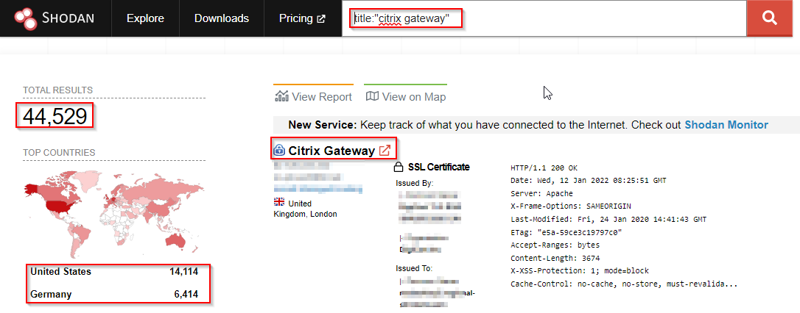

# Shodan.io DockList 2022 (SDL-22)
The SDL is an index of search queries (we call them dorks) used to find publicly available information, intended for pen testers and security researchers to find fruitful results from Shodan.  Shodan is a search engine that lets users search for various types of servers connected to the internet using a variety of filters. 

Here you can find variety of docks list to find usefull information about your target. e.g.

- Citrix - Find Citrix Gateway. Example: title:"citrix gateway"[/align]

Will try to keep it updated with new gathered docks.

Happy Hacking
